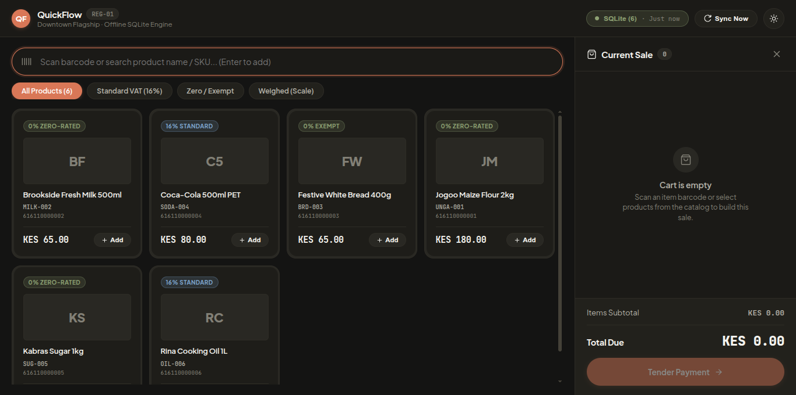

# QuickFlow — M-Pesa-First POS for Kenyan Retail


Offline-first point of sale for single-location retail/grocery. Cash is first-class, M-Pesa via Daraja STK Push, KRA eTIMS-ready. The till keeps selling with no network and syncs when back online.



## Download

Prebuilt installers are attached to each [GitHub Release](https://github.com/Xdashio/quick-flow/releases) (built by CI on every version tag).

| OS | File | Install |
|---|---|---|
| Ubuntu / Debian | `register_*.deb` | `sudo dpkg -i register_*.deb` |
| Any Linux distro | `QuickFlow Register-*.AppImage` | `chmod +x` it, then run |
| Windows 10 / 11 | `QuickFlow Register Setup *.exe` | Run the installer |

> Per-till data (offline SQLite cache, queued sales, printer output, backend URL) lives in the per-user app-data folder — `~/.config/register` (Linux), `%APPDATA%/register` (Windows) — so reinstalls and updates never wipe sales history.

## Features

**Register (till)**
- Offline-first cash checkout: sales queue locally and auto-sync when online
- Product catalog + tax categories synced from backend; barcode scan, search, weighed items
- ESC/POS receipts (network printer or virtual-printer file), cash-drawer kick, reason-coded no-sale opens
- Product image cache for fast catalog browsing
- Per-till backend URL configurable in-app by a technician — no rebuild, no env vars

**Backend**
- Products, tax categories (basis points), categories, inventory ledger + materialized stock view
- Transactions with idempotent client UUIDs and a guarded state machine
- Checkout + drawer-event endpoints the register syncs against
- M-Pesa Daraja STK Push + Till fallback, KRA eTIMS queue

**Dashboard**
- Manager view over live backend data (Next.js)

## Monorepo layout

```
package.json            # npm workspaces: shared, backend, register, dashboard
pos-system-blueprint.md # architecture, tax, offline, hardware (design reference)
shared/                 # canonical types — integer cents, basis points, enums
backend/                # NestJS API + Prisma (PostgreSQL)
register/               # Electron + React till (SQLite offline-first)
  electron/             # main / preload / sync / checkout queue / printer
  build/                # app icons (generated from assets/quickflow-icon.png)
dashboard/              # Next.js manager dashboard
assets/                 # logo sources
docs/                   # verification notes, screenshots
```

## Development

Prerequisites: Node.js ≥ 20.19, Docker.

```bash
npm install

# Postgres
npm run db:up
npm run db:ready

# Backend (needs backend/.env — copy backend/.env.example)
npm run dev:backend      # http://localhost:3000/api

# Dashboard
npm run dev:dashboard    # http://localhost:3001

# Register (Electron + Vite hot reload)
npm run dev:register
```

Seed the register's local SQLite cache for dev: `npm run db:init --workspace=register`.

## Building installers

```bash
npm run electron:build:linux --workspace=register   # AppImage + .deb → register/release/
npm run electron:build:win --workspace=register     # NSIS .exe (or via CI)
```

Release flow: push a tag (`git tag v0.2.0 && git push origin v0.2.0`) and the `Release` workflow builds Linux + Windows installers and publishes them to GitHub Releases automatically.

App icons live in `register/build/` (`icon.png` / `icon.ico` / `icon.icns`), generated from `assets/quickflow-icon.png`. Regenerate after changing the logo with `sharp` + `png2icons` (both already in devDependencies).

## Tech stack

| Layer | Choice |
|---|---|
| Runtime | Node.js Active LTS (≥ 20.19) |
| Backend | NestJS + Prisma + PostgreSQL 16 |
| Register | Electron + React 19 + Vite, SQLite via better-sqlite3 |
| Dashboard | Next.js App Router + React 19 |
| Types | TypeScript strict, `@pos/shared` |
| Payments | Daraja STK Push + Till reconcile (no cards) |
| Tax | KRA eTIMS-ready, VAT in basis points |

## Docs

- `pos-system-blueprint.md` — full system design
- `docs/PHASE1_VERIFICATION.md` — backend verification transcript (curl + psql)

## License

Private — all rights reserved.
